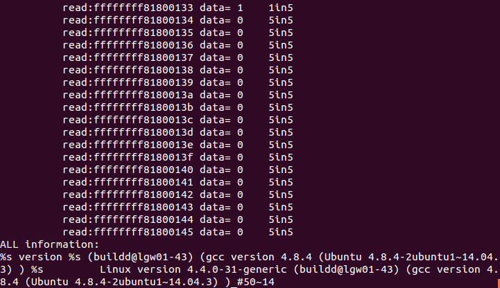

# Meltdown
### 王梓涵 PB16001707
## 攻击原理
### 乱序执行
乱序执行时一种优化技术，它允许CPU充分利用资源。早期的处理器顺序地执行既定的处理器指令，而现代处理器为了提高性能并不严格按照指令的顺序串行执行，而是对执行进行相关性分析后并行处理乱序执行。例如当处理器中的某些指令需要等待某些资源时，处理器不会真的等待而停止指令的执行，而是利用等待资源的时间继续执行后续的指令。在支持乱序执行的CPU中，后面的指令可能在前面指令执行结束前就开始执行了。
为了保证程序运行的正确性，处理器会对指令进行检查，只有当前用户权限符合指令权限时才能被执行，比如用户态指令访问内核内存处理器就会抛出异常。然而，这个安全检查只有当指令执行完成并且提交给系统之后才会发生。也就是说，在乱序执行的过程中，一条指令没有真正完成执行而只是加载到Cache中是不会执行安全检查的。如果这是一条由于乱序执行而提前的指令，并且这条指令之前的某条指令此时触发了异常，由于此时控制流需要跳转到异常处理程序而不是执行后续指令，这条指令会被处理器丢弃。但是这条指令对于缓存的操作在指令丢弃时不会被重置，因此Meltdown有了可乘之机。
### 缓存攻击
为了加快内存的访问和地址转换速度，CPU采用Cahce（缓存）技术来存储频繁使用的数据。现代处理器中通常使用多级缓存，对于多核处理器，有公用缓存也有对某一个核私有的缓存。地址转换表也存储在在内存中，也通过缓存技术缓存。
缓存侧信道攻击主要有Evict+Time、Prime+Probe与Flush+Reload等攻击方式。Flush+Reload正是利用了由缓存技术带来的时间差异。攻击者通过反复使用clflush指令使目标位置的数据在缓存中失效，同时测量重新加载数据所需的时间就可以得知另一个进程有没有将目标数据加载到缓存中。
## 攻击步骤
核心代码为下面三行，参考Meltdown论文，使用c的内联汇编编写。
```c
"movzx (%[addr]), %%eax\n\t"
"shl $12, %%rax\n\t"
"movzx (%[target], %%rax, 1), %%rbx\n"
```
第一行试图获取内核空间的内存信息，这条指令会报错，理论上这条指令之后的指令都不会执行。但是在乱序执行过程中，其后的指令都有可能执行，第二行指令将获取到的内核信息乘以4096，正好为一页的大小4K。第三行用第二行的结果作为探测数组的下标进行访存。这三行代码的功能是若从内核内存中获取了`(char)data`，则访问`target_array\[data*4096\]`。尽管执行完成第一行时就会发生段错误，乱序执行处理器有可能在执行第一行指令的过程中提前将2、3行的指令全部翻译为微操作等待处理。此时如果处理器发现段错误的时间晚于执行完第三行指令的微操作，尽管内核内容不会被真的转移到rax，探测数组中的某些内容会被写入缓存。
注意到对于不同的data，数据会被加载到不同的页中。因此攻击者只需在调用这三行代码之前清空target缓存，在这三行代码执行后对target进行不断的读操作，找到一页的访问时间明显低于其余页，那么攻击者就知道了内核内存中的数据。事实上，由于一次获取一字节数据，有0-255共256种可能，攻击者只需要试探最多256次即可得到一字节数据。  
总体步骤为
```c
flush();
speculate(addr);
check();
```  
采用Flush+Reload攻击缓存。`flush()`清空target数组，使所有页全部移出缓存，`speculate(addr)`对目标地址进行探测，`check()`检查target数组，判断哪一页被移入了缓存。
## 实现细节
* 对于判断某一页是否在缓存之中，攻击开始之前先进行测试，测试分别10000次不在缓存中和在缓存中的访存速度，取乘积开根号为阀值。
* 抑制段错误发生的手段是将发生段错误时的服务函数改为直接返回发生错误的`speculate()`函数。
* 获取访存时间使用`__rdtscp(*p)`获取一个时间戳，单位是机器周期。
* 攻击的目标为`/proc/version`文件，必须要在程序中事先打开才能正确攻击。
* 攻击的地址可以在`/proc/kallsyms`中得到，但此步必须要root权限才能获得，此步是本攻击中唯一需要root权限的地方。
* 对同一个地址进行1000次试探，取得到最多次的数据作为一个结果；取5个结果中出现最多的字符进行输出和记录。
## 预期结果
攻击具有随机性，不能保证100%正确，但是成功率很高，可以通过多次重复攻击来交叉检验和确定实际数据。
实验环境为Ubuntu 14.04.5 LTS，内核版本4.4.0-31-generic。  
直接`make`后运行`./run.sh`即可，第一次使用需要root权限获取地址。
读取50个数据，结果如图。  
  
打开MOREINFO。  
  
当然也可以读取更多数据

可以看到完整读出了`/proc/version`中关于版本的内容。  

## 参考资料
* [meltdown论文](https://meltdownattack.com/meltdown.pdf)
* [github上的一个POC](https://github.com/paboldin/meltdown-exploit.git)
* [AT&T汇编语言语法](https://blog.csdn.net/Levet/article/details/78516307)
