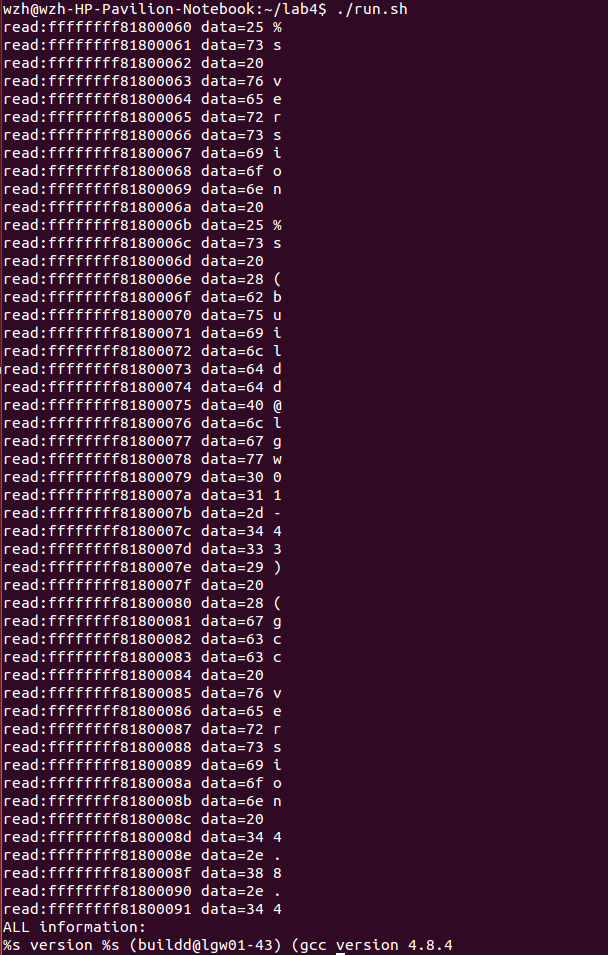

# Meltdown攻击
### 王梓涵 PB16001707
## 攻击原理
通过乱序执行，CPU有可能将不应执行断越权指令提前执行放入缓存。待CPU发现错误后并不会清空缓存，这时可利用访存时间进行攻击。
## 攻击步骤
核心代码为下面三行，参考Meltdown论文。
```
"movzx (%[addr]), %%eax\n\t"
"shl $12, %%rax\n\t"
"movzx (%[target], %%rax, 1), %%rbx\n"
```
使用c的内联汇编编写，通过将不同的内容写到不同的页实施攻击。  
总体步骤为
```
flush();
speculate(addr);
check();
```
flush清空target数组，使所有页全部移出缓存，speculate对目标地址进行探测，check检查target数组，判断哪一页被移入了缓存。
## 实现细节
* 对于判断某一页是否在缓存之中，攻击开始之前先进行测试，测试分别10000次不在缓存中和在缓存中断访存速度，取乘积开根号为阀值。
* 抑制段错误发生的手段是将发生段错误时的服务函数改为直接返回发生错误的speculate函数。
* 获取访存时间使用__rdtscp(*p)获取一个时间戳，单位是机器周期。
* 攻击的目标为/proc/version文件，必须要在程序中事先打开才能正确攻击。
* 攻击的地址可以在/proc/kallsyms中得到，但此步必须要root权限才能获得，此步是本攻击中唯一需要root权限的地方。
## 预期结果
攻击具有随机性，不能保证100%正确，但是成功率很高，可以通过多次重复攻击来交叉检验和确定实际数据。
读取50个数据，结果如图。  
  
打开MOREINFO。  
  

## 参考资料
* [meltdown论文](https://meltdownattack.com/meltdown.pdf)
* [github上的一个POC](https://github.com/paboldin/meltdown-exploit.git)
